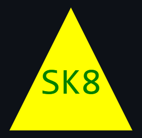

# Logo Maker

## Description
To create a SVG logo maker through utilizing node.js, inquirer and jest. Once the code
has been executed through the command line terminal, the user will be prompted to answer
questions which will create a svg file with the specified answers.

## 
  ## Table of Contents
  - [Installation](#installation)
  - [Usage](#usage)
  - [Contributing](#contributing)
  - [Tests](#tests)
  - [Questions](#questions)
  

## Installation
Node.js 
inquirer v8.2.4
jest
SVG Previwer
Visual Studio Code

## Usage
To create a unique svg file when prompted through the command line terminal.

## License
N/A

## Contributing
Chase Barrett-Brown

## Tests

The framework Jest was used for testing code such as incorrectly entered
user prompts, for example using an incorrect hexidecimal value or entering
an invalid color keyword.

## Screenshot

### Circle

### Triangle

### Square

## Questions
If you have any questions, feel free to reach out to me:

GitHub: [Mrgnoblennon](https://github.com/Mrgnoblennon)

Email: chasebarrettbrown@hotmail.com

